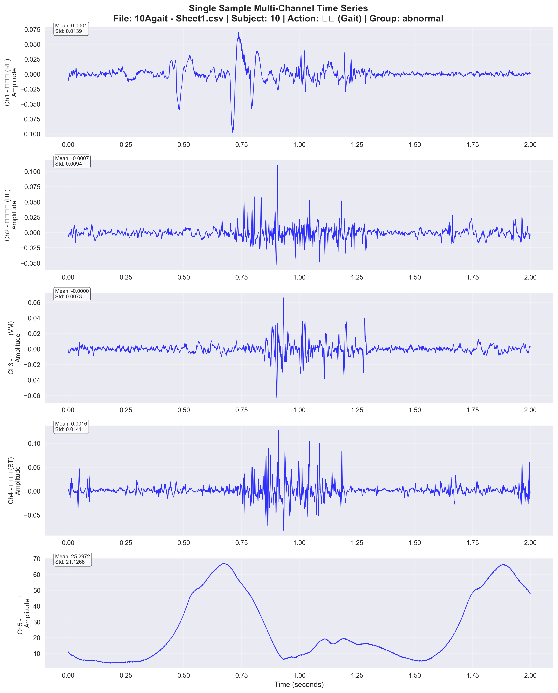
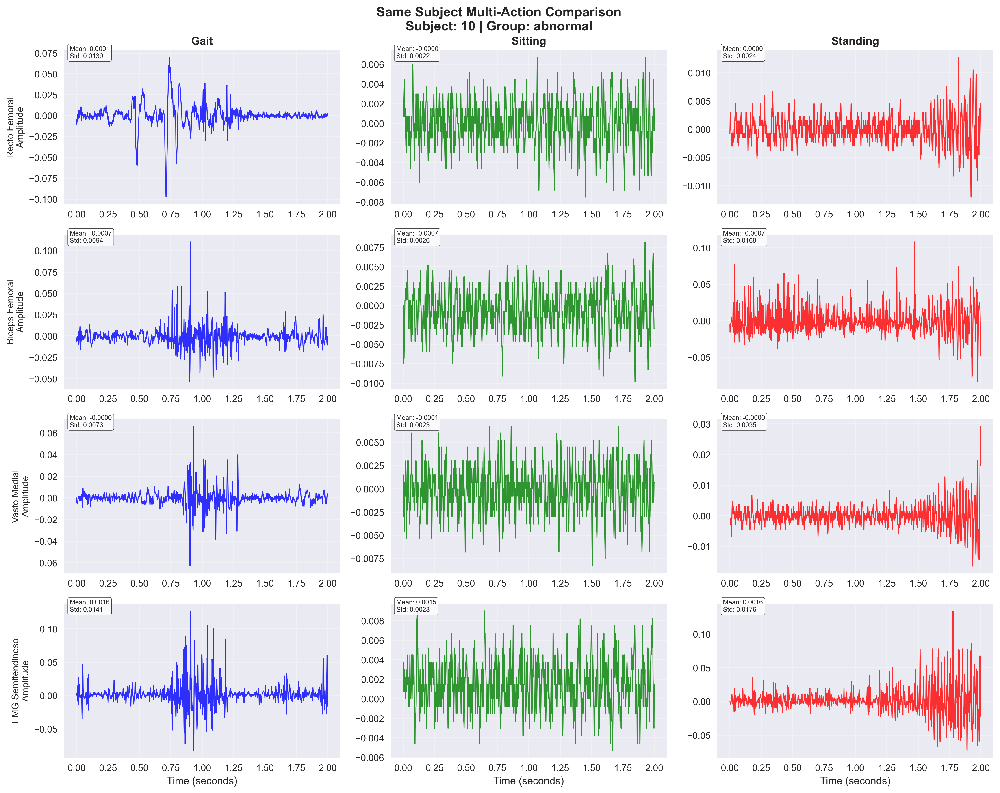
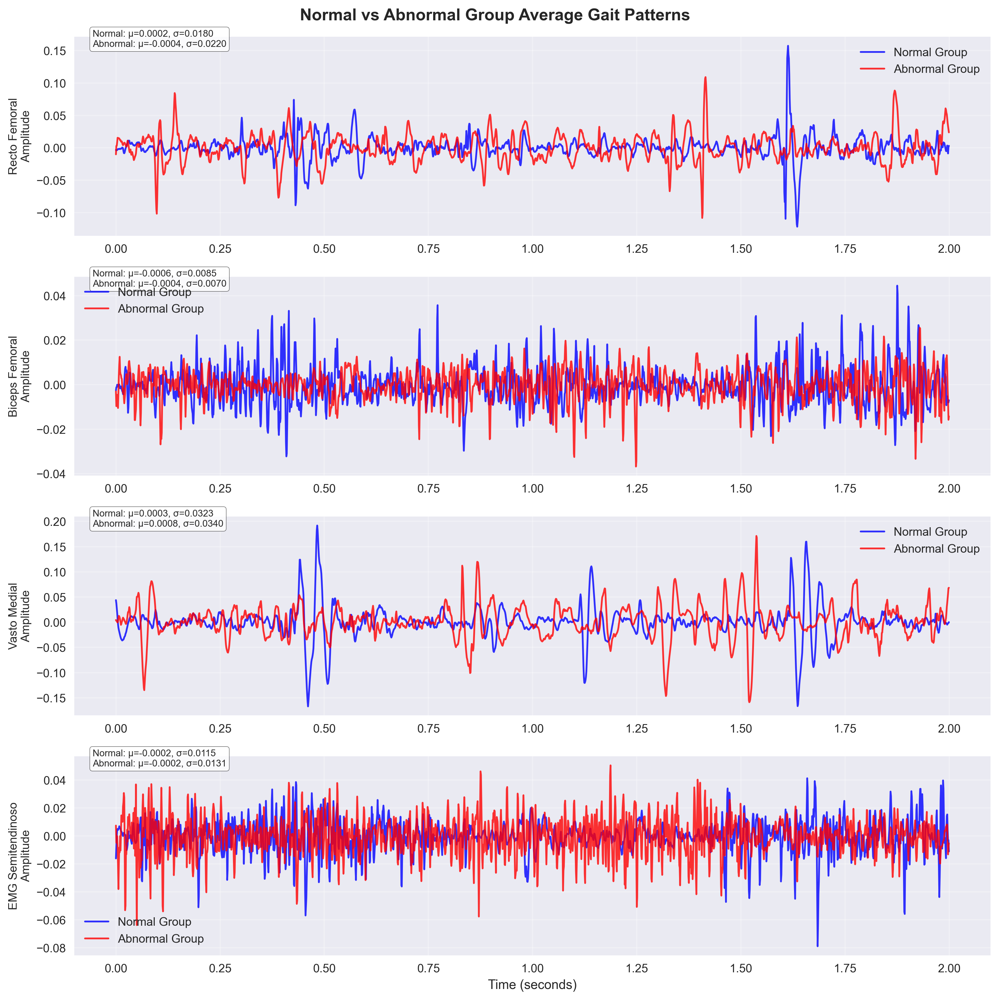
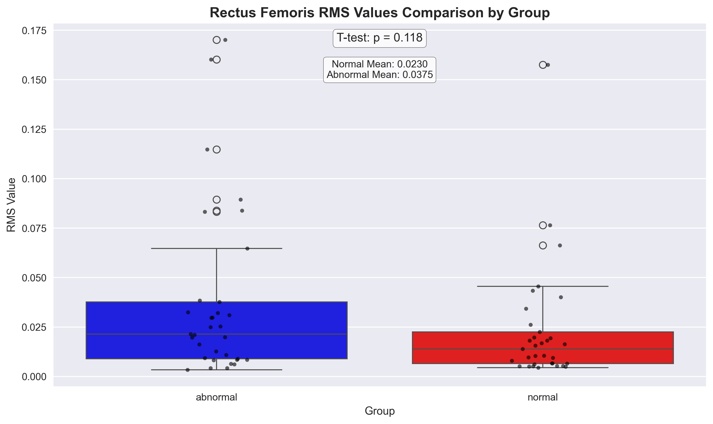
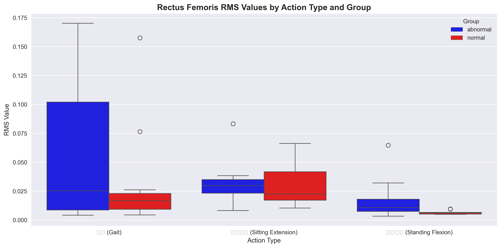
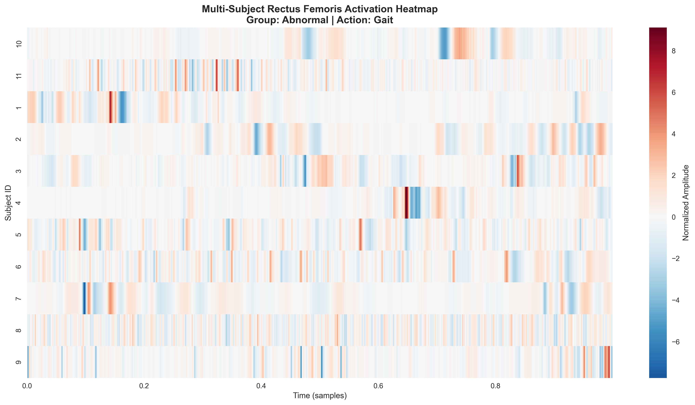
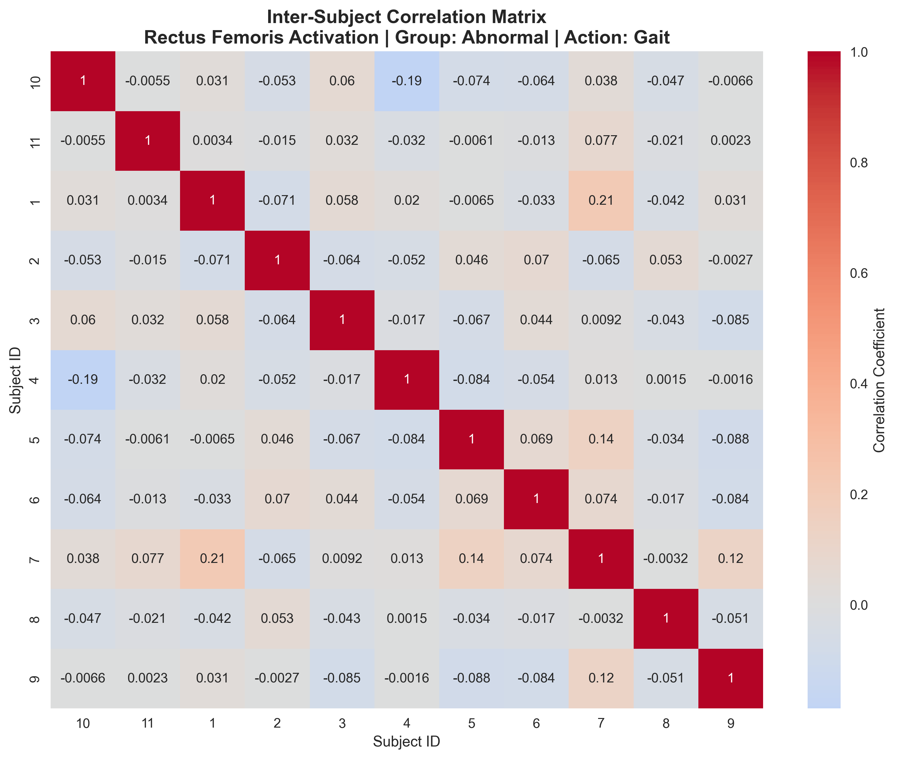
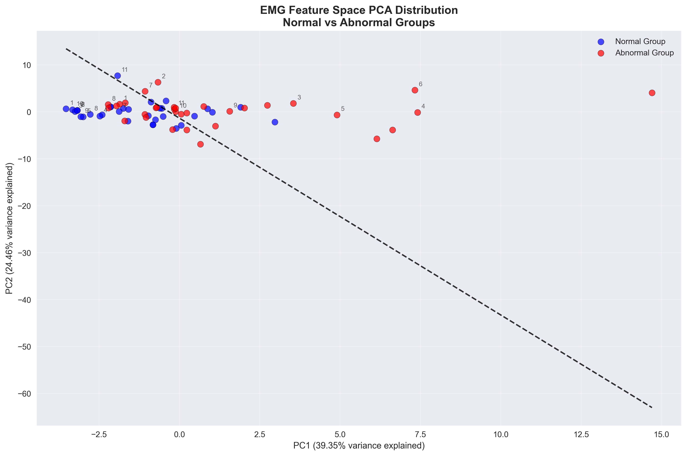
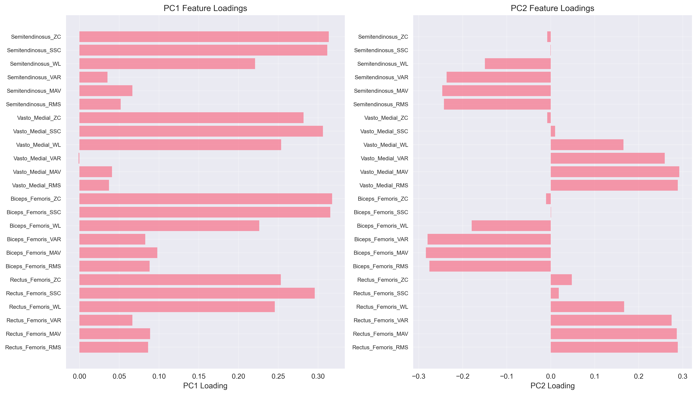

# EMG数据可视化图表说明文档

## 概述

本文档详细说明EMG数据可视化工具生成的各类图表及其含义，帮助用户理解肌电信号数据的特征和分析结果。所有图表自动保存到`plots`目录，可通过文件名引用查看具体图表。

## 图表类型说明

### 1. 单样本多通道时序信号图 (Single Sample Multi-Channel Time Series)
**文件名格式**: `single_sample_timeseries_样本信息_时间戳.png`
**示例文件**: `single_sample_timeseries_10Agait_-_Sheet1_20251020_163055.png`

**图表含义**:
- 展示单个样本文件中5个通道的原始肌电信号时间序列
- 每个子图显示一个通道的信号波形、均值和标准差统计信息
- 用于评估原始信号质量和通道间同步性

**解读要点**:
- **信号质量**: 观察信号是否清晰，有无明显噪声干扰
- **通道同步**: 检查不同肌肉在时间上的激活模式是否协调
- **统计特征**: 通过均值和标准差了解信号的基本特征
- **异常检测**: 识别异常信号模式或数据质量问题

**应用场景**:
- 单个受试者肌电信号质量评估
- 信号预处理前的数据检查
- 通道间同步性分析

### 2. 同一受试者多动作对比图 (Same Subject Multi-Action Comparison)
**文件名格式**: `same_subject_multi_action_受试者ID_时间戳.png`
**示例文件**: `same_subject_multi_action_10_20251020_163102.png`

**图表含义**:
- 比较同一受试者在不同动作（步行、坐姿伸腿、站立屈膝）下的肌电信号
- 4×3子图布局，显示4个肌电通道在3种动作下的信号特征
- 揭示个体在不同运动模式下的肌肉激活差异

**解读要点**:
- **动作特异性**: 观察不同动作下肌肉激活模式的差异
- **个体特征**: 了解特定受试者的肌肉协调模式
- **功能适应**: 分析肌肉如何适应不同的运动需求
- **一致性**: 检查同一受试者不同动作间的信号稳定性

**应用场景**:
- 个体运动功能评估
- 康复训练效果监测
- 运动模式适应性研究

### 3. 正常组与异常组步态平均激活模式图 (Group Average Gait Pattern)
**文件名格式**: `group_average_gait_pattern_时间戳.png`
**示例文件**: `group_average_gait_pattern_20251020_163111.png`

**图表含义**:
- 比较正常组和异常组在步行动作下的平均肌电激活模式
- 4个通道分别显示两组平均信号和标准差范围
- 揭示两组在步态周期中的系统性肌电差异

**解读要点**:
- **组间差异**: 识别正常组和异常组在步态中的系统性差异
- **激活模式**: 分析两组在步态周期中的肌肉激活时序
- **变异性**: 通过标准差了解组内个体差异程度
- **临床意义**: 结合步态功能解读肌电差异的临床意义

**应用场景**:
- 异常步态识别研究
- 康复治疗效果评估
- 疾病诊断辅助分析

### 4. 股四头肌RMS值箱线图对比 (Rectus Femoris RMS Boxplot Comparison)
**文件名格式**: `rectus_femoris_rms_boxplot_时间戳.png`
**示例文件**: `rectus_femoris_rms_boxplot_20251020_163130.png`

**文件名格式**: `rectus_femoris_rms_by_action_时间戳.png`
**示例文件**: `rectus_femoris_rms_by_action_20251020_163130.png`

**图表含义**:
- 比较正常组和异常组股直肌（Rectus Femoris）RMS值的分布差异
- 箱线图显示中位数、四分位数、异常值等统计特征
- 包含t检验显著性标注和按动作类型分组的对比

**解读要点**:
- **肌电强度**: RMS值反映肌电信号的平均强度水平
- **组间差异**: 通过箱线图直观比较两组分布差异
- **统计显著性**: t检验结果指示差异是否具有统计学意义
- **动作影响**: 分析不同动作对肌电强度的影响

**应用场景**:
- 肌肉功能定量评估
- 治疗效果量化分析
- 运动功能客观评价

### 5. 多受试者股直肌激活热力图 (Multi-Subject Rectus Femoris Activation Heatmap)
**文件名格式**: `multi_subject_rectus_femoris_heatmap_组别_动作_时间戳.png`
**示例文件**: `multi_subject_rectus_femoris_heatmap_abnormal_gait_20251020_163138.png`

**文件名格式**: `inter_subject_correlation_组别_动作_时间戳.png`
**示例文件**: `inter_subject_correlation_abnormal_gait_20251020_163138.png`

**图表含义**:
- 展示同一组别多个受试者股直肌激活模式的热力图
- 行表示不同受试者，列表示时间序列
- 颜色深浅反映肌电信号强度，揭示群体内激活一致性

**解读要点**:
- **群体一致性**: 观察群体内个体间激活模式的一致性程度
- **时间模式**: 分析激活在时间维度上的分布特征
- **个体差异**: 识别群体中的异常个体或特殊模式
- **相关性**: 通过相关矩阵量化个体间相似性

**应用场景**:
- 群体运动模式研究
- 个体差异分析
- 运动技能评估

### 6. EMG特征空间PCA分布图 (EMG Feature Space PCA Distribution)
**文件名格式**: `emg_feature_pca_distribution_时间戳.png`
**示例文件**: `emg_feature_pca_distribution_20251020_163153.png`

**文件名格式**: `pca_feature_loadings_时间戳.png`
**示例文件**: `pca_feature_loadings_20251020_163153.png`

**图表含义**:
- 使用主成分分析（PCA）将高维EMG特征降维到二维空间
- 显示正常组和异常组在特征空间中的分布和可分性
- 包含特征重要性分析和组间分离度量化

**解读要点**:
- **特征可分性**: 评估正常与异常组在特征空间中的分离程度
- **主成分解释**: 了解PC1和PC2解释的方差比例
- **特征重要性**: 分析哪些EMG特征对分类贡献最大
- **决策边界**: 线性分类器显示两组的最佳分离边界

**应用场景**:
- 机器学习特征工程
- 疾病分类模型开发
- 多维数据分析

## 数据通道说明

### 通道1: 股直肌 (Rectus Femoris)
- **功能**: 膝关节伸展和髋关节屈曲
- **临床意义**: 评估步态周期中的支撑相

### 通道2: 股二头肌 (Biceps Femoris)
- **功能**: 膝关节屈曲和髋关节伸展
- **临床意义**: 评估步态周期中的摆动相

### 通道3: 股内侧肌 (Vastus Medialis)
- **功能**: 膝关节伸展稳定
- **临床意义**: 评估膝关节稳定性

### 通道4: 半腱肌 (Semitendinosus)
- **功能**: 膝关节屈曲和髋关节伸展
- **临床意义**: 评估腘绳肌功能

### 通道5: 膝关节角度 (Knee Joint Angle)
- **功能**: 记录膝关节屈伸角度
- **临床意义**: 量化步态运动学特征

## 动作类型说明

### 步行 (Gait)
- **描述**: 正常行走动作
- **分析重点**: 步态周期、肌肉协调性

### 坐姿伸腿 (Sitting Extension)
- **描述**: 坐姿下膝关节伸展
- **分析重点**: 股四头肌功能评估

### 站立屈膝 (Standing Flexion)
- **描述**: 站立位膝关节屈曲
- **分析重点**: 腘绳肌功能评估

## 图表解读指南

### 正常信号特征
- 肌电信号: 振幅适中，频率稳定，无明显噪声
- 角度信号: 平滑变化，符合生理运动规律
- 组间差异: 正常组信号一致性较高

### 异常信号特征
- 肌电信号: 振幅异常（过高或过低），频率不稳定
- 角度信号: 运动范围受限，模式异常
- 统计特征: 均值或方差与正常组存在显著差异

### 数据分析建议
1. **质量检查**: 首先检查信号质量，排除噪声干扰
2. **组间比较**: 重点关注异常组与正常组的系统性差异
3. **通道分析**: 结合肌肉功能解读各通道信号
4. **动作关联**: 分析不同动作下的信号特征变化

## 技术参数

- **采样率**: 1000 Hz
- **图像分辨率**: 300 DPI
- **文件格式**: PNG
- **时间戳**: YYYYMMDD_HHMMSS格式

## 故障排除

### 常见问题
1. **图像保存失败**: 检查plots目录权限
2. **内存不足**: 减少同时显示的样本数量
3. **显示异常**: 检查matplotlib版本兼容性

### 性能优化建议
- 对于大数据集，建议分批处理
- 使用交互式探索功能进行初步分析
- 保存重要图表用于后续报告

## 扩展功能

### 自定义分析
用户可以根据需要修改代码，添加:
- 特定频段分析
- 时频分析图表
- 机器学习特征提取

### 报告生成
结合保存的图表，可以:
- 生成数据分析报告
- 制作学术演示材料
- 创建临床评估文档

---

*本文档最后更新: 2024年*  
*如有问题，请参考代码注释或联系开发团队*