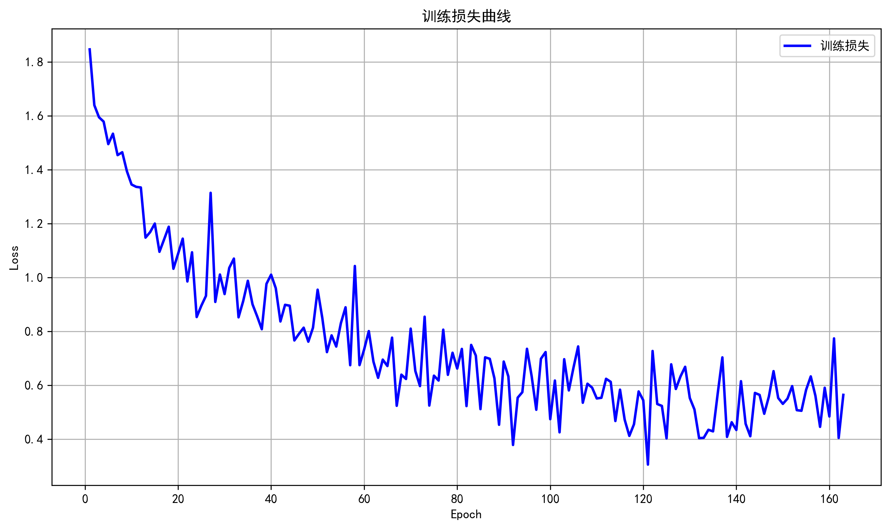
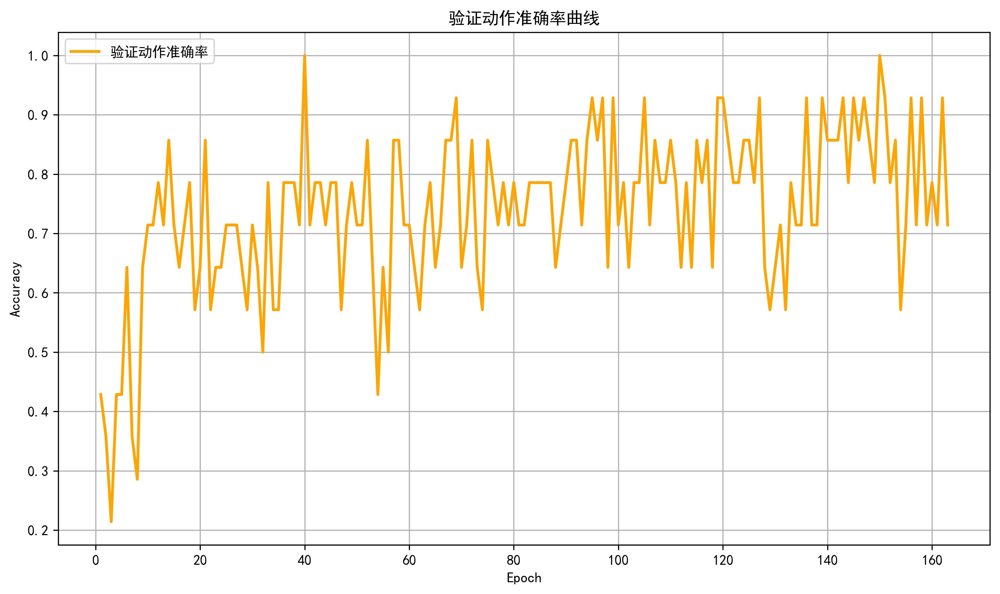
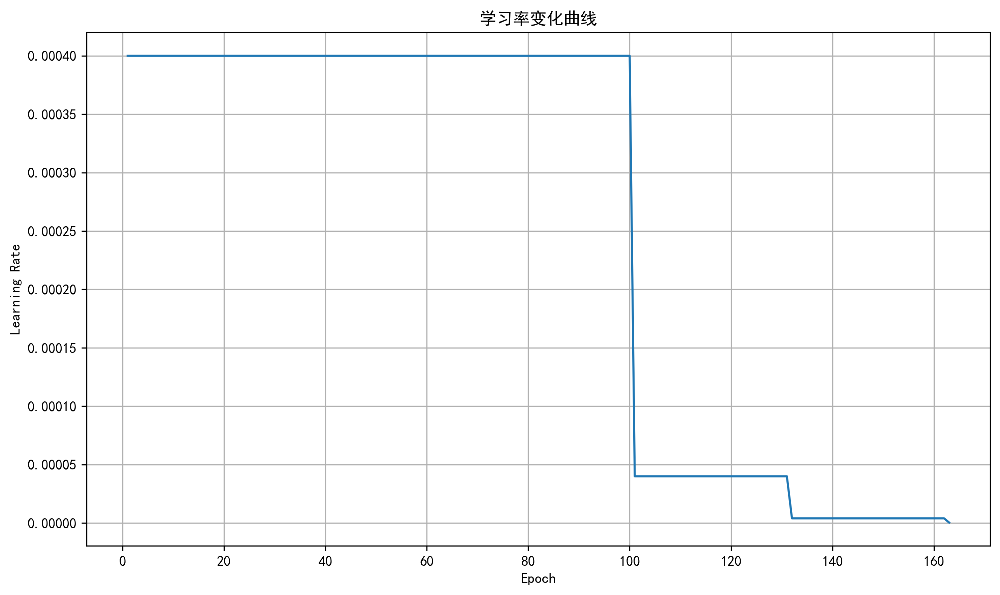
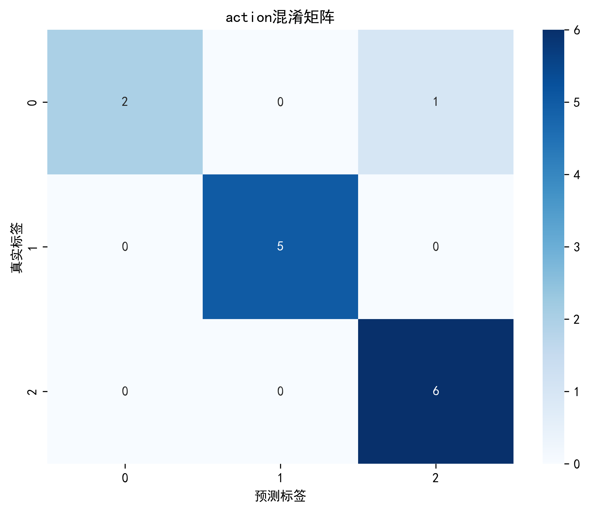
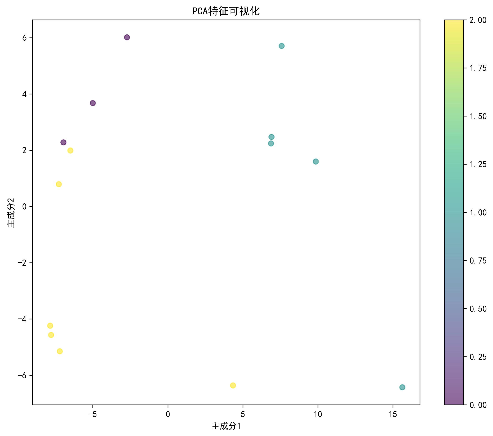
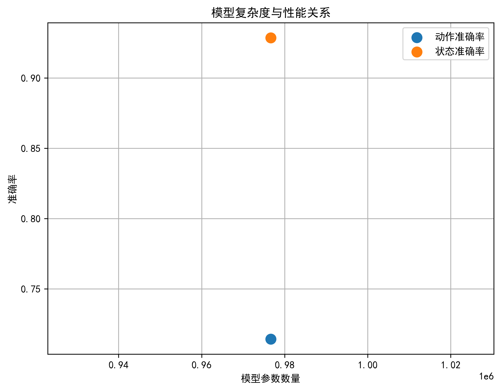

# 下肢EMG信号分类模型说明文档

## 概述

本项目包含4个深度学习模型，用于下肢EMG信号的分类任务。模型基于不同的神经网络架构，旨在识别下肢动作和状态。

## 模型列表

### 1. LSMModel v1.1.1
- **架构类型**: LSTM模型
- **主要特点**: 简单LSTM结构，适合序列数据处理

### 2. LSTM_AttentionModel v1.1.2  
- **架构类型**: LSTM + 注意力机制
- **主要特点**: 引入注意力机制，提升关键特征提取能力

### 3. CNN_LSTMModel v1.1.3
- **架构类型**: CNN + LSTM混合模型
- **主要特点**: CNN提取局部特征，LSTM处理时序依赖

### 4. TransformerModel v2.0
- **架构类型**: Transformer编码器
- **主要特点**: 自注意力机制，并行处理能力

## 模型架构详情

### LSMModel v1.1.1
```
输入层 (8维EMG信号) → LSTM层 (128隐藏单元) → 全连接层 → 输出层 (动作分类 + 状态分类)
```

### LSTM_AttentionModel v1.1.2
```
输入层 → LSTM层 → 注意力层 → 全连接层 → 输出层
```

### CNN_LSTMModel v1.1.3
```
输入层 → 1D卷积层 → LSTM层 → 全连接层 → 输出层
```

### TransformerModel v2.0
```
输入层 → 位置编码 → Transformer编码器层 → 全连接层 → 输出层
```

## 技术参数

### 优化器参数
- **优化器**: Adam
- **学习率**: 0.001
- **权重衰减**: 0.0001

### 学习率调度器
- **类型**: 11种可选调度器
- **默认**: 'plateau'（基于验证集性能调整）
- **其他选项**: 'step', 'cosine', 'exponential', 'cyclic'等

### 损失函数
- **动作分类**: CrossEntropyLoss
- **状态分类**: CrossEntropyLoss

## 训练成果

### 性能对比
| 模型版本 | 动作准确率 | 状态准确率 | 平均准确率 | 训练时间 |
|---------|-----------|-----------|-----------|----------|
| v1.1.1 | 21.43% | 85.71% | 53.57% | 50.64s |
| v1.1.2 | 78.57% | 85.71% | 82.14% | 待测试 |
| v1.1.3 | 14.29% | 85.71% | 50.00% | 待测试 |
| v2.0 | 71.43% | 92.86% | 82.14% | 157.63s |

## 可视化分析

### 训练曲线
每个模型版本包含以下可视化图表：


*训练损失变化曲线*


*验证集动作准确率曲线*


*学习率调整曲线*

### 混淆矩阵

*动作分类混淆矩阵*


*状态分类混淆矩阵*

### 特征分析

*PCA特征重要性分析*


*模型复杂度与性能关系*

## 数据预处理

### 数据标准化
- 使用StandardScaler进行Z-score标准化
- 基于训练集计算均值和标准差

### 数据增强
- 带通滤波：20-500Hz巴特沃斯滤波器
- 窗口化处理：变长序列处理
- 动态批处理：支持变长序列

## 训练配置

### 超参数
- **批次大小**: 32
- **早停机制**: 耐心值20
- **最大训练轮数**: 1000
- **验证集比例**: 20%

### 设备配置
- **训练设备**: CUDA (GPU加速)
- **数据加载器**: Windows系统num_workers=0

## 模型文件说明

### 主要文件
- `best_model.pth`: 训练得到的最佳模型权重
- `Accuracy.csv`: 训练过程中的准确率记录

### 可视化文件
每个模型版本包含12个可视化图表文件，涵盖训练过程的各个方面。

## 使用说明

### 模型选择
根据具体需求选择合适的模型：
- **高精度需求**: 选择TransformerModel v2.0
- **实时性要求**: 选择LSMModel v1.1.1
- **平衡性能**: 选择LSTM_AttentionModel v1.1.2

### 调度器选择
根据训练数据特性选择学习率调度器：
- **稳定收敛**: 'plateau'
- **快速收敛**: 'cosine'
- **探索性训练**: 'cyclic'

### 训练命令
```bash
python train.py
```

### 测试命令
```bash
python test_model.py
```

## 注意事项

1. 确保CUDA环境配置正确
2. 数据路径设置正确
3. 模型版本与数据预处理方式匹配
4. 定期备份模型权重文件

