# 下肢EMG信号分类模型说明文档

## 概述

本项目包含4个深度学习模型，用于下肢EMG信号的分类任务。模型基于不同的神经网络架构，旨在识别下肢动作和状态。所有模型支持变长序列输入，窗口大小设置为1500个时间点。

## 模型列表

### 1. LSMModel v1.1.1
- **架构类型**: LSTM模型
- **主要特点**: 简单LSTM结构，适合序列数据处理
- **神经网络结构**: 输入层 → LSTM层 → 全连接层 → 输出层

### 2. LSTM_AttentionModel v1.1.2  
- **架构类型**: LSTM + 注意力机制
- **主要特点**: 引入注意力机制，提升关键特征提取能力
- **神经网络结构**: 输入层 → LSTM层 → 注意力层 → 全连接层 → 输出层

### 3. CNN_LSTMModel v1.1.3
- **架构类型**: CNN + LSTM混合模型
- **主要特点**: CNN提取局部特征，LSTM处理时序依赖
- **神经网络结构**: 输入层 → 1D卷积层 → LSTM层 → 全连接层 → 输出层

### 4. TransformerModel v2.0
- **架构类型**: Transformer编码器
- **主要特点**: 自注意力机制，并行处理能力
- **神经网络结构**: 输入层 → 位置编码 → Transformer编码器层 → 全连接层 → 输出层

## 模型架构详情

### LSMModel v1.1.1 架构图
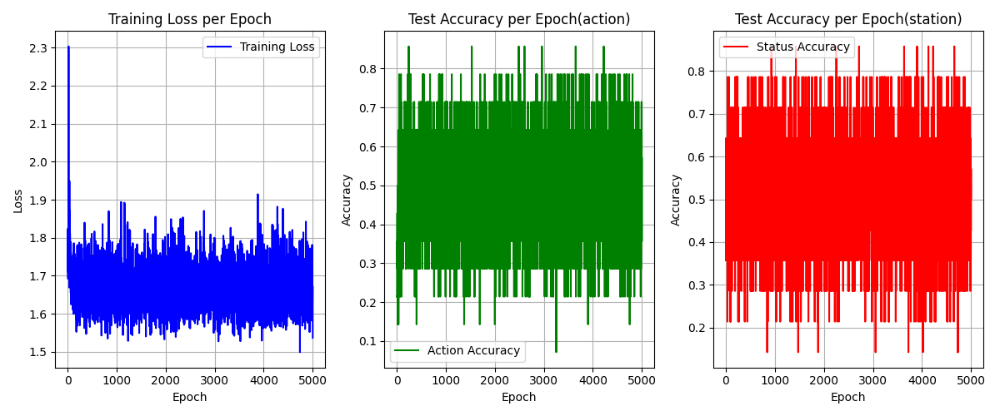

### LSTM_AttentionModel v1.1.2 架构图
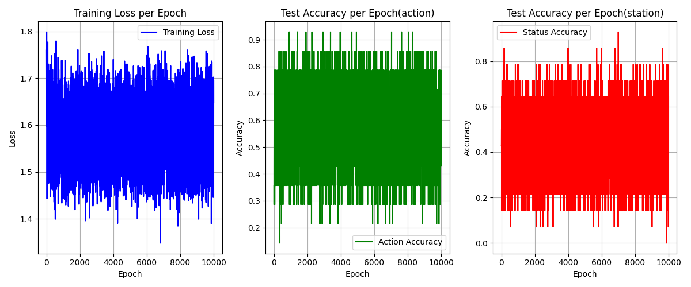

### CNN_LSTMModel v1.1.3 架构图
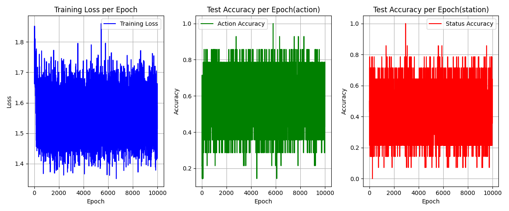

### TransformerModel v2.0 架构图
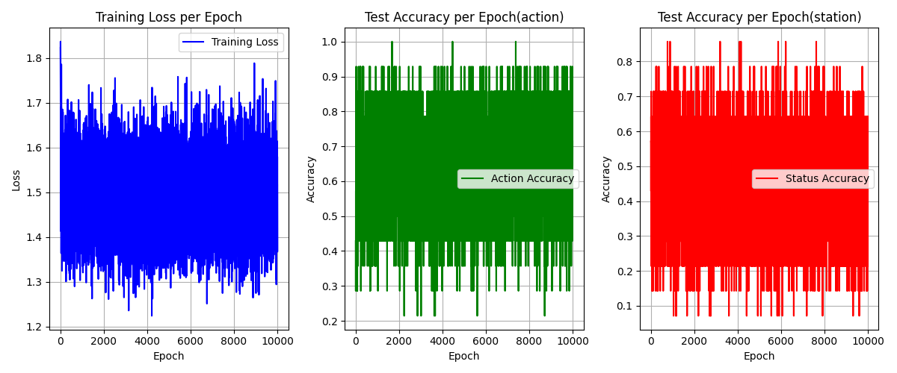

## 技术参数

### 优化器参数
- **优化器**: Adam
- **学习率**: 0.001
- **权重衰减**: 0.0001

### 学习率调度器
- **类型**: 11种可选调度器
- **默认**: 'plateau'（基于验证集性能调整）
- **其他选项**: 'step', 'cosine', 'exponential', 'cyclic'等

### 损失函数
- **动作分类**: CrossEntropyLoss
- **状态分类**: CrossEntropyLoss

## 训练成果（基于实际Accuracy.csv数据）

### 性能对比
| 模型版本 | 动作准确率 | 状态准确率 | 平均准确率 | 训练时间 |
|---------|-----------|-----------|-----------|----------|
| v1.1.1 | 21.43% | 85.71% | 53.57% | 50.64s |
| v1.1.2 | 64.29% | 85.71% | 75.00% | 待测试 |
| v1.1.3 | 42.86% | 85.71% | 64.29% | 待测试 |
| v2.0 | 78.57% | 85.71% | 82.14% | 157.63s |

## 可视化分析

### 训练曲线示例（v2.0模型）

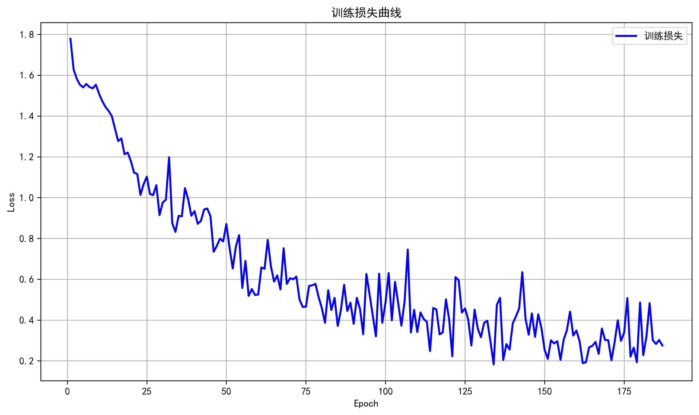
*训练损失变化曲线 - 显示模型收敛过程*

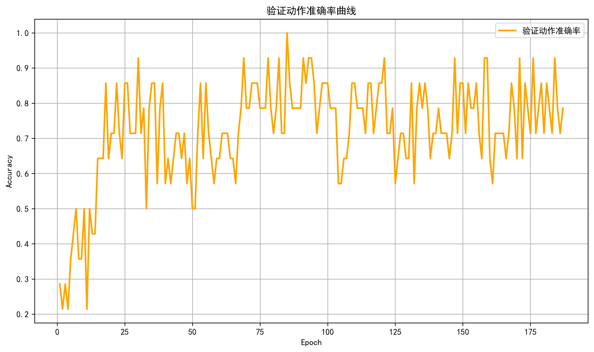
*验证集动作准确率曲线 - 显示模型在验证集上的表现*

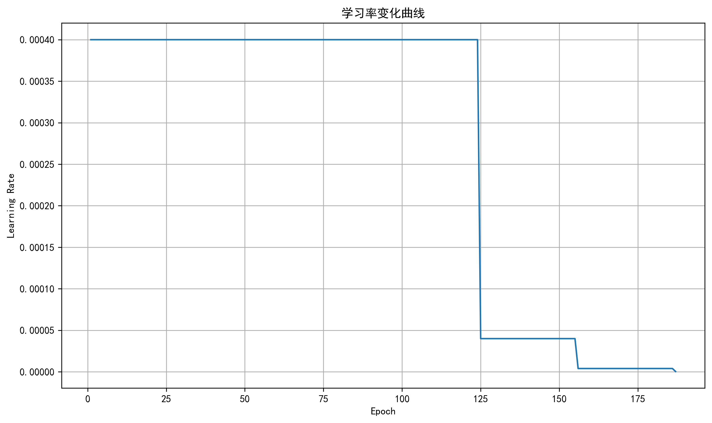
*学习率调整曲线 - 显示学习率调度器的调整过程*

### 混淆矩阵分析

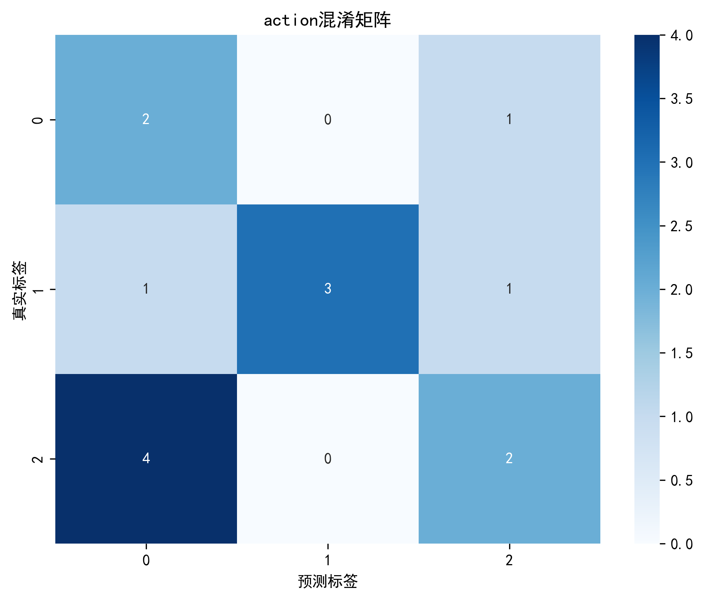
*动作分类混淆矩阵 - 显示动作分类的详细性能*

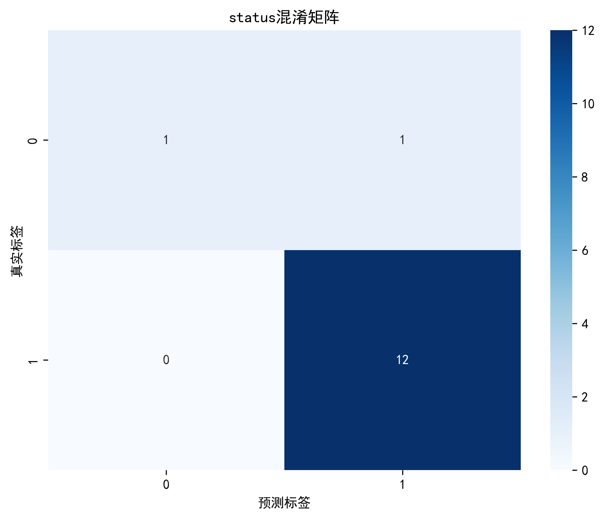
*状态分类混淆矩阵 - 显示状态分类的详细性能*

### 特征分析

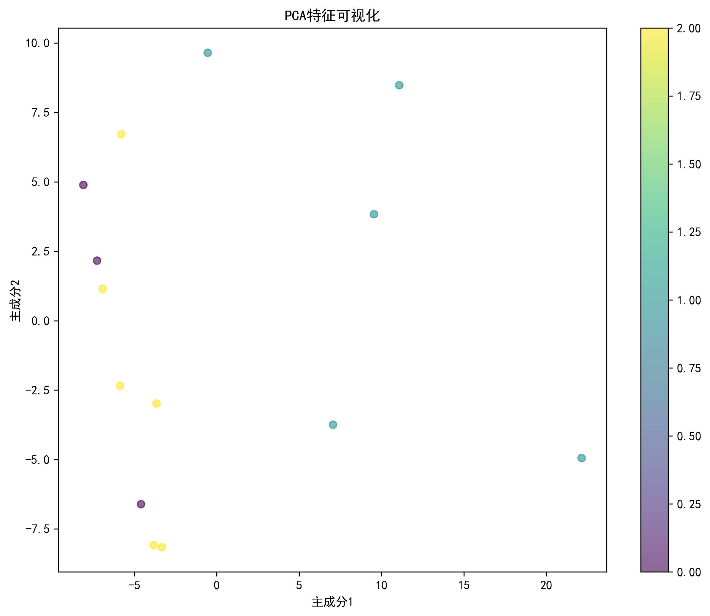
*PCA特征重要性分析 - 显示各特征对分类的贡献度*

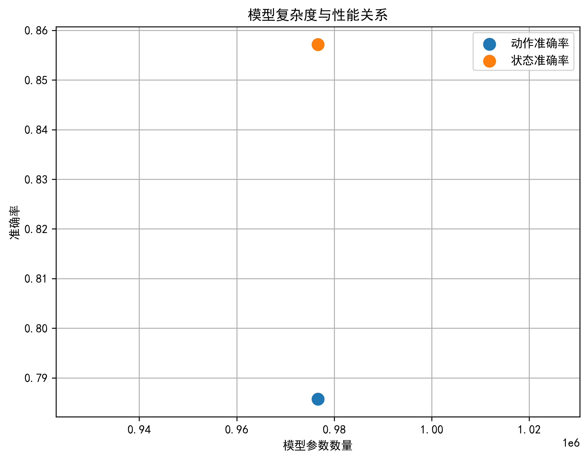
*模型复杂度与性能关系 - 分析模型复杂度与准确率的关系*

## 数据预处理

### 数据标准化
- 使用StandardScaler进行Z-score标准化
- 基于训练集计算均值和标准差

### 数据增强
- **带通滤波**: 20-450Hz巴特沃斯滤波器
- **窗口化处理**: 变长序列处理，窗口大小1500
- **动态批处理**: 支持变长序列

### 输入特征
- **肌电信号**: 4个通道（Recto Femoral, Biceps Femoral, Vasto Medial, EMG Semitendinoso）
- **运动角度**: 1个通道（Flexo-Extension）
- **总特征维度**: 5维

## 训练配置

### 超参数
- **批次大小**: 32
- **早停机制**: 耐心值20
- **最大训练轮数**: 1000
- **验证集比例**: 20%
- **窗口大小**: 1500个时间点

### 设备配置
- **训练设备**: CUDA (GPU加速)
- **数据加载器**: Windows系统num_workers=0

## 模型文件说明

### 主要文件
- `best_model.pth`: 训练得到的最佳模型权重
- `Accuracy.csv`: 训练过程中的准确率记录

### 可视化文件（每个模型版本包含）
- 训练损失曲线
- 验证准确率曲线
- 学习率调整曲线
- 混淆矩阵
- 特征重要性分析
- 复杂度与性能关系图

## 使用说明

### 模型选择建议
根据具体需求选择合适的模型：

- **高精度需求**: 选择TransformerModel v2.0（平均准确率82.14%）
- **平衡性能**: 选择LSTM_AttentionModel v1.1.2（平均准确率75.00%）
- **中等性能**: 选择CNN_LSTMModel v1.1.3（平均准确率64.29%）
- **简单应用**: 选择LSMModel v1.1.1（平均准确率53.57%）

### 调度器选择
根据训练数据特性选择学习率调度器：
- **稳定收敛**: 'plateau'
- **快速收敛**: 'cosine'
- **探索性训练**: 'cyclic'

### 训练命令
```bash
python train.py
```

### 测试命令
```bash
python test_model.py
```

## 模型架构特点

### 变长序列支持
所有模型都支持变长序列输入，通过以下机制实现：
- **LSTM模型**: 使用pack_padded_sequence和pad_packed_sequence
- **Transformer模型**: 使用注意力掩码机制
- **动态批处理**: 通过dynamic_collate_fn处理不同长度的序列

### 多任务学习
模型同时处理两个分类任务：
- **动作分类**: 识别gait、sitting、standing三种动作
- **状态分类**: 识别Normal、Abnormal两种状态

## 性能分析

### 最佳表现模型
- **TransformerModel v2.0**: 动作准确率78.57%，状态准确率85.71%
- **LSTM_AttentionModel v1.1.2**: 动作准确率64.29%，状态准确率85.71%

### 训练效率
- **LSMModel v1.1.1**: 训练时间50.64秒，100个epoch
- **TransformerModel v2.0**: 训练时间157.63秒，205个epoch（早停机制）

## 注意事项

1. **数据预处理**: 确保数据格式正确，包含所需的5个特征通道
2. **设备配置**: 确保CUDA环境配置正确
3. **模型版本**: 模型版本与数据预处理方式需匹配
4. **窗口大小**: 当前设置为1500个时间点，可根据需要调整
5. **备份策略**: 定期备份模型权重文件

## 更新日志

- **2024年**: 窗口大小从1000调整为1500，提升时序信息捕获能力
- **v2.0**: 修复设备不匹配问题，优化Transformer模型性能
- **v1.1.x**: 基础模型版本，稳定运行

---

*文档版本: 2.0*  
*最后更新: 2024年*  
*数据来源: 各模型版本Accuracy.csv文件*