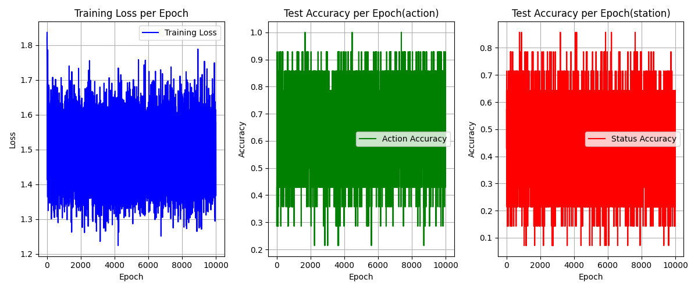

# Model Training

## Model v1.0
LSTM模型
```{.python}
class MultiTaskModel(nn.Module):
    def __init__(self, input_size=4, hidden_size=100, num_actions=3):
        super(MultiTaskModel, self).__init__()
        # LSTM层
        self.lstm = nn.LSTM(input_size, hidden_size, bidirectional=False,batch_first=True)
        
        # 共享全连接层
        self.shared_fc = nn.Linear(hidden_size, 50)
        
        # 动作分类分支
        self.action_classifier = nn.Linear(50, num_actions)
        
        # 状态分类分支
        self.status_classifier = nn.Linear(50, 1)

    def forward(self, x):
        # LSTM前向传播
        lstm_out, _ = self.lstm(x)
        lstm_out = lstm_out[:, -1, :]  # 获取最后一个时间步的输出
        
        # 共享层前向传播
        shared_rep = torch.relu(self.shared_fc(lstm_out))
        
        # 分支输出
        action_output = self.action_classifier(shared_rep)
        status_output = torch.sigmoid(self.status_classifier(shared_rep))
        
        return action_output, status_output
```

## Model v1.1
增加隐藏层
```{.python}
class MultiTaskModel(nn.Module):
    def __init__(self, input_size=4, hidden_size=200, num_actions=3):
        super(MultiTaskModel, self).__init__()
        # LSTM层
        self.lstm = nn.LSTM(input_size, hidden_size, bidirectional=False,batch_first=True)
        
        # 共享全连接层
        self.shared_fc = nn.Linear(hidden_size, 50)
        
        # 动作分类分支
        self.action_classifier = nn.Linear(50, num_actions)
        
        # 状态分类分支
        self.status_classifier = nn.Linear(50, 1)

    def forward(self, x):
        # LSTM前向传播
        lstm_out, _ = self.lstm(x)
        lstm_out = lstm_out[:, -1, :]  # 获取最后一个时间步的输出
        
        # 共享层前向传播
        shared_rep = torch.relu(self.shared_fc(lstm_out))
        
        # 分支输出
        action_output = self.action_classifier(shared_rep)
        status_output = torch.sigmoid(self.status_classifier(shared_rep))
        
        return action_output, status_output
```


### Model v1.1.1
```
class MultiTaskModel(nn.Module):
    def __init__(self, input_size=4, hidden_size=200, num_actions=3,dropout_rate=0.5):
        super(MultiTaskModel, self).__init__()
        # LSTM层
        self.lstm = nn.LSTM(input_size, hidden_size, bidirectional=False,batch_first=True)
        
        # 共享全连接层
        self.shared_fc = nn.Linear(hidden_size, 50)
        
        # 动作分类分支
        self.action_classifier = nn.Linear(50, num_actions)
        
        # 状态分类分支
        self.status_classifier = nn.Linear(50, 1)

        self.dropout = nn.Dropout(dropout_rate)

    def forward(self, x):
        # LSTM前向传播
        lstm_out, _ = self.lstm(x)
        lstm_out = lstm_out[:, -1, :]  # 获取最后一个时间步的输出
        
        # 共享层前向传播
        shared_rep = torch.relu(self.shared_fc(lstm_out))
        shared_rep = self.dropout(shared_rep)
        
        # 分支输出
        action_output = self.action_classifier(shared_rep)
        status_output = torch.sigmoid(self.status_classifier(shared_rep))
        
        return action_output, status_output
```

Best test accuracy (Action): 92.8571%

Best test accuracy (Status): 64.2857%

Best model saved with average accuracy: 78.5714%

## Model v1.2
300 hidden layers
dropout layer
```
class MultiTaskModel(nn.Module):
    def __init__(self, input_size=4, hidden_size=300, num_actions=3, dropout_rate=0.5):
        super(MultiTaskModel, self).__init__()
        # LSTM层
        self.lstm = nn.LSTM(input_size, hidden_size, bidirectional=False, batch_first=True)
        
        # 共享全连接层
        self.shared_fc = nn.Linear(hidden_size, 50)
        
        # Dropout 层
        self.dropout = nn.Dropout(dropout_rate)
        
        # 动作分类分支
        self.action_classifier = nn.Linear(50, num_actions)
        
        # 状态分类分支
        self.status_classifier = nn.Linear(50, 1)

    def forward(self, x):
        # LSTM前向传播
        lstm_out, _ = self.lstm(x)
        lstm_out = lstm_out[:, -1, :]  # 获取最后一个时间步的输出
        
        # 共享层 + ReLU + Dropout
        shared_rep = torch.relu(self.shared_fc(lstm_out))
        shared_rep = self.dropout(shared_rep)  # 在共享表示后添加 Dropout
        
        # 分支输出
        action_output = self.action_classifier(shared_rep)
        status_output = torch.sigmoid(self.status_classifier(shared_rep))
        
        return action_output, status_output
```

## Model v2.0
Transformer模型
```{.python}
class MultiTaskModel(nn.Module):
    def __init__(self, input_size=4, hidden_size=200, num_actions=3, num_layers=2, nhead=2):
        super(MultiTaskModel, self).__init__()
        
        # 线性层将输入映射到 Transformer 的 hidden_size
        self.input_projection = nn.Linear(input_size, hidden_size)
        
        # Transformer 编码器层
        encoder_layer = nn.TransformerEncoderLayer(
            d_model=hidden_size,
            nhead=nhead,
            dim_feedforward=hidden_size * 4,
            activation='relu'
        )
        
        # Transformer 编码器
        self.transformer_encoder = nn.TransformerEncoder(encoder_layer, num_layers=num_layers)
        
        # 共享全连接层
        self.shared_fc = nn.Linear(hidden_size, 50)
        
        # 动作分类分支
        self.action_classifier = nn.Linear(50, num_actions)
        
        # 状态分类分支
        self.status_classifier = nn.Linear(50, 1)

    def forward(self, x):
        # x shape: (batch_size, seq_len, input_size)
        
        # 投影到 hidden_size
        x = self.input_projection(x)  # (batch_size, seq_len, hidden_size)

        # Transformer 要求 shape 为 (seq_len, batch_size, hidden_size)
        x = x.permute(1, 0, 2)  # 转换为 (seq_len, batch_size, hidden_size)
        x = self.transformer_encoder(x)  # (seq_len, batch_size, hidden_size)
        
        # 取最后一个时间步的输出
        transformer_out = x[-1, :, :]  # (batch_size, hidden_size)

        # 共享层前向传播
        shared_rep = torch.relu(self.shared_fc(transformer_out))
        
        # 分支输出
        action_output = self.action_classifier(shared_rep)
        status_output = torch.sigmoid(self.status_classifier(shared_rep))
        
        return action_output, status_output
```


## Model v2.1
```
scheduler = optim.lr_scheduler.ReduceLROnPlateau(optimizer, 'min', patience=10, factor=0.1)
```
* **patience=10** 
    Best test accuracy (Action): 85.7143%
    Best test accuracy (Status): 78.5714%
    Best model saved with average accuracy: 82.1429%
* **patience=20** 
    Best test accuracy (Action): 85.7143%
    Best test accuracy (Status): 64.2857%
    Best model saved with average accuracy: 75.0000%
* **patience=30**
    Best test accuracy (Action): 92.8571%
    Best test accuracy (Status): 78.5714%
    Best model saved with average accuracy: 85.7143%
* **patience=40**
    Best test accuracy (Action): 78.5714%
    Best test accuracy (Status): 78.5714%
    Best model saved with average accuracy: 78.5714%

```
optimizer = optim.Adam(model.parameters(), lr=0.001)
```
patience=30

* **lr=0.001**
    Best test accuracy (Action): 92.8571%
    Best test accuracy (Status): 78.5714%
    Best model saved with average accuracy: 85.7143%
* **lr=0.0001**
    Best test accuracy (Action): 85.7143%
    Best test accuracy (Status): 64.2857%
    Best model saved with average accuracy: 75.0000%
* **lr=0.0005**
    Best test accuracy (Action): 92.8571%
    Best test accuracy (Status): 64.2857%
    Best model saved with average accuracy: 78.5714%
* **lr=0.005**
    Best test accuracy (Action): 71.4286%
    Best test accuracy (Status): 64.2857%
    Best model saved with average accuracy: 67.8571%

**Final result**
    Best test accuracy (Action): 71.4286%
    Best test accuracy (Status): 71.4286%
    Best model saved with average accuracy: 71.4286%


Best test accuracy (Action): 62.1212%

Best test accuracy (Status): 81.8182%

Best average accuracy: 71.9697%
